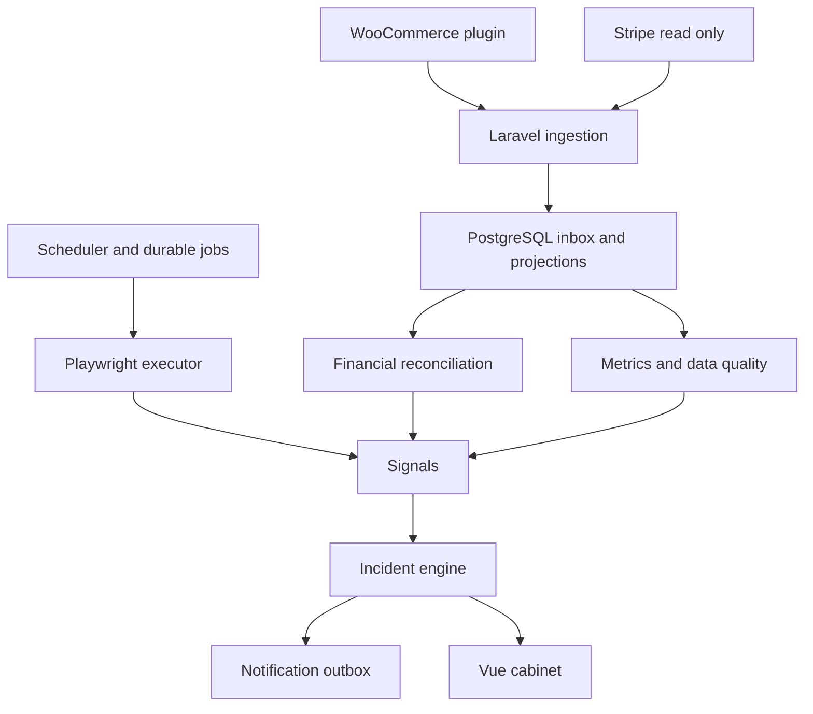

# Техническое задание Business Watchdog

Версия 1.1 от 8 октября 2026 года. Основа версии1.0 от 7 октября сохранена; добавлены отдельные ТЗ административных панелей, клиентских кабинетов и оплаты нашей услуги. Рабочее название продукта допускается изменить без изменения требований. Язык разработки и технической документации — русский; имена сущностей, кода и API — английские.

Документ определяет SaaS для обнаружения финансовых расхождений и поломок пути покупки в интернет-магазинах. Он предназначен владельцу проекта и помощнику Codex как основание для реализации, тестирования и приёмки. Это проектное ТЗ, а не утверждение, что система уже создана или что выбранные параметры проверены на реальных клиентах.

**Решение:** модульный монолит Laravel, WooCommerce-плагин, независимый источник финансовых операций Stripe и изолированный браузерный исполнитель Playwright. Основной результат — понятный инцидент с доказательствами. ИИ в текущей реализации отсутствует.

## 1 Назначение и критерии успеха

Система должна ответить на четыре вопроса: что обнаружено, когда обнаружено, чем подтверждается и что владельцу проверить. Пользователь не обязан ежедневно просматривать отчёты. При исправных источниках он получает уведомления о проблемах и, по желанию, краткую сводку.

Целевая аудитория первой версии — небольшие WooCommerce-магазины с одним сайтом, обычными товарами и одним поддерживаемым Stripe-аккаунтом. Один tenant может содержать несколько магазинов. Агентства получают доступ к нескольким tenant через членство; данные разных клиентов не объединяются.

Продукт проверяет согласованность данных и доступность сценария; не заменяет бухгалтерию, не переводит деньги, не возвращает платежи, не меняет статусы заказов и не исправляет сайт автоматически. Отсутствие тревоги не является гарантией отсутствия проблем.

| ID | Измеримый результат | Проверка |
|---|---|---|
| GOAL-01 | Найдено расхождение заказа и независимых платежей | Контрольные финансовые примеры дают ожидаемые результаты |
| GOAL-02 | Обнаружена поломка корзины или checkout | Искусственно сломанная тестовая страница создаёт подтверждённый сигнал |
| GOAL-03 | Повторные события не удваивают деньги и уведомления | Дубли, перестановка событий и crash recovery |
| GOAL-04 | Нет тревоги о падении продаж при потере данных | Сбой доставки создаёт data quality incident |
| GOAL-05 | В уведомлении отделены факты от предположений | Проверка шаблонов и доказательств |
| GOAL-06 | Браузерная проверка не создаёт настоящую покупку | Запрещены submit order и платёжные mutation endpoints |

## 2 Приоритеты и состав релизов

Слово MUST означает обязательное требование соответствующего этапа. SHOULD — полезное требование, которое можно перенести только с записью причины в журнал решений. LATER — вне текущего релиза. Этапы нельзя считать взаимозаменяемыми.

| Этап | Обязательный состав | Что допустимо обещать клиенту |
|---|---|---|
| P0 Технический пилот | Tenant, доступы, Woo-плагин, durable ingestion, heartbeat, заказы и возвраты, безопасный Playwright, серверное наблюдение попыток оплаты (§17.1, слой 1), инциденты, email, минимальный кабинет | Проверка пути до формы оплаты, целостности данных магазина и наблюдение за исходами реальных попыток оплаты |
| P1 Первая коммерческая версия | Всё P0, Stripe read-only, идентификация транзакций, backfill и reconciliation, скрипт наблюдения нажатия оплаты на странице checkout (§17.1, слой 2), уведомления Telegram, подписка и лимиты, эксплуатационные процедуры | Независимая сверка поддерживаемых операций WooCommerce и Stripe; обнаружение ситуаций, когда реальные покупатели не могут оплатить |
| P2 Аномалии продаж | Полнота истории, сезонные baseline, серверные продажи; при включённой телеметрии — наблюдаемая воронка | Обнаружение статистических отклонений с указанием ограничений |
| LATER Расширения | Shopify, PayPal, другие gateway, WebKit и Firefox, фактический тест платежа в sandbox, payout reconciliation | Отдельное ТЗ и матрица поддержки |

Публично платный P0 возможен только с описанием его ограниченного покрытия; называть его независимым контролем денег нельзя. P1 должен пройти все обязательные тесты до первого коммерческого подключения. Разработка ИИ, vector DB, LLM SDK, промптов и AI-браузера не входит ни в один этап этого ТЗ.

В P1 из сверки магазинов исключены их собственные recurring subscriptions, marketplace, split payments, Connect destination charges, gift cards, мультивалютный расчёт заказа с конвертацией, депозиты и частичные оплаты сторонними плагинами. Это ограничение не относится к продаже подписки на сам Business Watchdog: её recurring billing входит в P1 и описан в дополнении1.1. Архитектура допускает несколько платежей и распределения суммы; адаптеры исключённых магазинных сценариев пока показывают unsupported. Наличная оплата, COD и bank transfer не объявляются неоплаченными ошибочно: для них независимое подтверждение недоступно.

## 3 Основные термины

**Tenant** — организация и граница доступа. **Store** — подключённый магазин. **Integration** — один источник данных с отдельными credentials и capabilities. **Event** — уникальное наблюдение источника. **Projection** — восстановимое текущее представление заказа или платежа. **Payment transaction** — конкретная финансовая операция, а не webhook об этой операции. **Coverage** — известное покрытие источниками. **Signal** — результат одного правила. **Incident** — объединённая проблема. **Check run** — логический браузерный запуск, **attempt** — его техническая попытка. **Finding** — результат одной сверки. **Watermark** — граница подтверждённого покрытия по времени и типу объектов.

Фраза «получено» требует уточнения: captured — списано с покупателя, settled — отражено на балансе процессинга, paid out — отправлено на банковский счёт. В P1 проверяется capture/refund, а не фактическое зачисление в банк.

## 4 Стек и управление версиями

| Компонент | Решение | Ограничение |
|---|---|---|
| Backend | Laravel 13, PHP 8.4 | 64-bit runtime, composer.lock, необходимые PHP extensions |
| Frontend | Vue 3 и TypeScript, Vite, SPA с Sanctum | Same-origin session, CSRF, без JWT в localStorage |
| БД | PostgreSQL 18 | Миграции Laravel — производственный источник схемы |
| Очереди | Redis и Laravel Horizon | Redis не является единственным хранилищем задания |
| Browser service | Node.js 24 LTS, TypeScript, Playwright | patch и образ Chromium зафиксированы совместно |
| Storage | Private S3-compatible bucket | MinIO для локальной разработки |
| Web | nginx и PHP-FPM | TLS в production |
| Поставка | Docker Compose на старте | Раздельные containers и лимиты ресурсов |
| Тесты | PHPUnit или Pest, Vitest, Playwright | Одна выбранная PHP test framework |
| Качество | PHPStan, Pint, ESLint, TypeScript strict | Обязательны в CI |

На старте P0 создаётся `docs/compatibility.md` с точными WordPress, WooCommerce, Stripe gateway, PHP и Playwright версиями, а также проверенными темами. «Latest» не допускается в production image tags. Patch-версии выбираются при реализации из поддерживаемых выпусков и фиксируются lock-файлами и digest. Laravel 13 допускает PHP 8.3–8.5 согласно официальной документации; выбран PHP 8.4. Прошлые предположения о конкретном PostgreSQL patch не являются требованием.

Плагин SHOULD поддерживать PHP 8.2+ независимо от PHP backend. Реальную нижнюю границу WordPress/WooCommerce фиксировать после compatibility spike, а не выдумывать до теста. Поддерживаются HPOS и legacy order storage через Woo CRUD API, а не SQL к `wp_posts`.

## 5 Архитектура и границы модулей



Laravel-модули: Identity, Tenancy, Stores, Integrations, Ingestion, Commerce, Payments, Reconciliation, Metrics, BrowserChecks, Signals, Incidents, Notifications, Billing, Audit. HTTP controllers валидируют DTO и вызывают application services; бизнес-правила не располагаются в контроллерах, Eloquent observers и Vue.

Внутри модуля: Domain — value objects, правила и интерфейсы; Application — сценарии и транзакции; Infrastructure — Eloquent, HTTP, очереди, storage; Http — requests/resources/controllers. Модульный монолит не требует отдельных БД или процессов для каждого модуля.

**Критическое решение очереди:** PHP jobs используют Horizon. Node не читает сериализованные Laravel jobs из Redis. Для браузера — отдельный internal HTTP lease protocol и таблицы `check_runs`/`check_attempts`; Redis можно использовать только для wake-up. Источник правды о запуске и аренде — PostgreSQL. Это исключает зависимость Node от внутреннего PHP queue format.

Внутренние interfaces: `Connector`, `EventNormalizer`, `ProjectionBuilder`, `PaymentMatcher`, `ReconciliationRule`, `MetricDetector`, `IncidentCorrelator`, `NotificationChannel`, `ArtifactStore`, `BrowserExecutor`. Каждый connector возвращает capabilities; отсутствие capability — unknown/unsupported, а не нулевая сумма.

## 6 Репозиторий и рабочее окружение

```text
business-watchdog/
  apps/backend/                  Laravel
  apps/frontend/                 Vue
  apps/browser-worker/           Node and Playwright
  plugins/woocommerce-watchdog/   PHP and checkout integration JS
  contracts/                     OpenAPI and JSON Schemas
  database/reference/            Reviewed SQL snapshot
  docs/                          TZ, ADR, operations, compatibility
  tests/fixtures/                Synthetic stores and provider events
  infra/                         Docker Compose, nginx, scripts
  AGENTS.md                      Rules for Codex
  Makefile
```

Локально MUST работать на macOS Apple Silicon и Linux amd64. Не требовать production credentials. Compose содержит PostgreSQL, Redis, MinIO, mail catcher, API, scheduler, PHP workers, frontend и browser worker; тестовый WooCommerce запускается отдельным profile. Fixtures с имитацией Stripe используются без внешней сети; sandbox smoke необязателен для каждого локального запуска, но обязателен перед коммерческой поддержкой gateway.

Команды, которые должны существовать в готовом репозитории: `make setup`, `make up`, `make migrate`, `make seed-demo`, `make test`, `make lint`, `make reset-demo`, `make down`. Пока код отсутствует, эти команды не считаются реализованными. Bootstrap обязан создавать `.env.example` без секретов, lock-файлы, health endpoints и README.

## 7 Роли и права

| Действие | Owner | Admin | Operator | Viewer |
|---|---|---|---|---|
| Читать магазины и инциденты | Да | Да | Да | Да |
| Acknowledge и comment | Да | Да | Да | Нет |
| Запустить проверку | Да | Да | Да | Нет |
| Изменить rules и расписания | Да | Да | Нет | Нет |
| Подключать источники и channels | Да | Да | Нет | Нет |
| Приглашать пользователей | Да | Да | Нет | Нет |
| Billing и удалить tenant | Да | Нет | Нет | Нет |
| Передать владение | Да | Нет | Нет | Нет |

System operator не является tenant role. Его технический доступ отделён, требует MFA и audit. Support получает диагностические сведения без secrets и PII. Impersonation LATER; в P0/P1 скрытого входа от имени клиента нет.

Дополнение1.1 закрепляет platform_owner, platform_admin, platform_support и platform_billing в отдельном staff guard. Owner/Admin в таблице этого раздела — только роли клиента. Файлы `panels/OWNER-PANEL.md`, `panels/ADMIN-PANEL.md` и `panels/CLIENT-PANELS.md` содержат подробные экраны и policy; platform права не выдаются через memberships.

Регистрация email+password, подтверждение email, reset token с TTL, session revoke, password hashing штатным Laravel механизмом. MFA обязательно для системных администраторов, SHOULD для tenant owner. Invitation содержит одноразовый token hash, срок 72 часа и конкретную роль. Нельзя удалить последнего owner; смена роли и передача владения — транзакционные операции.

## 8 Подключение магазина

1. Owner создаёт store и задаёт публичный HTTPS URL, timezone IANA, язык и основную валюту.
2. Сервис проверяет URL с правилами SSRF и выдаёт короткоживущий одноразовый pairing code, привязанный к tenant/store. TTL 15 минут, 5 попыток.
3. Администратор WordPress устанавливает plugin, вводит code и разрешает перечисленные типы передачи данных.
4. Plugin отправляет code на заданный production SaaS endpoint; получает integration ID, key ID и secret один раз. Код погашается транзакционно.
5. SaaS проверяет владение доменом случайным challenge в WordPress REST endpoint или через DNS. До проверки browser jobs запрещены.
6. Plugin сообщает capabilities, cart/checkout URLs, HPOS, versions, gateway IDs, classic/blocks checkout и тестовый товар.
7. Сервис запускает backfill, проверяет heartbeat, выполняет безопасный check и показывает покрытие.
8. Stripe read-only подключается отдельно на P1. Store↔account связь явно подтверждается; одна связь не означает, что каждый заказ оплачен этим аккаунтом.
9. Кабинет показывает «Подключено, идёт синхронизация», «Готово» либо «Нужно внимание» с конкретной причиной. До завершения backfill запрещено показывать «Всё нормально» для денег.

Одновременно два активных connector одного `connector_code` для одного store не допускаются. При reinstall connector/plugin/app сохраняет install UUID и выданные secrets, если они не отозваны. При переносе домена нужна повторная верификация и обновление allowlist; автоматически следовать на новый чужой домен нельзя.

## 9 WooCommerce plugin

Плагин MUST использовать `wc_get_order`, order CRUD, официальные hooks, Action Scheduler и WordPress REST API. Работа с HPOS и Blocks декларируется только после тестов. После hook пересчитывается snapshot заказа; webhook не считается финансовой операцией сам по себе.

Обрабатываются создание заказа, изменение статуса/суммы/transaction ID, payment completion, создание/изменение refund, удаление заказа, изменение Woo/theme/plugin versions. Hooks могут вызываться несколько раз: plugin outbox и snapshot revision предотвращают дубли. Для сторонних gateway, которые не вызывают ожидаемый hook, периодический rescan остаётся обязательным.

Плагин не выполняет внешний HTTP синхронно в checkout request. Hook сохраняет компактный локальный snapshot/outbox либо ставит задачу; отдельный worker отправляет batch. При невозможности локальной записи MUST зафиксировать health error и инициировать rescan; не ломать заказ покупателя. Plugin self-monitoring сообщает backlog, oldest pending, retries, последнюю успешную отправку и результат rescan.

Локальные таблицы с префиксом WordPress: `{prefix}bw_outbox` — bigint ID, event UUID unique, aggregate key, revision bigint, sanitized payload, hash, state, attempts, next_attempt_at, timestamps; `{prefix}bw_revisions` — aggregate key PK, revision bigint, snapshot hash; `{prefix}bw_state` — cursors/config version/install UUID. InnoDB, миграция через dbDelta, отдельная версия схемы. Revision выдается при наблюдении snapshot с atomic counter; рескан создаёт новую revision только при новом snapshot hash. Ревизия показывает порядок наблюдений, а не доказывает исторический порядок всех Woo hooks.

Retry local: 30 с, 2 мин, 10 мин, 1 ч, затем до 6 ч с jitter ±20%. Ошибки 401/403 приостанавливают отправку и требуют reconnect; 429 учитывает Retry-After; 422 переносит event в dead letter и отображает ошибку. Outbox MUST не удалять до подтверждения accepted/duplicate. Через 7 дней backlog не отбрасывается молча: показывать degraded, ограничить размер и запустить восстановление по snapshot. Превышение локального лимита 100 000 событий требует операционного решения и предотвращения роста диска; заказы продолжать принимать.

WP-Cron зависит от трафика. Для production SHOULD рекомендовать системный cron/Action Scheduler runner. Plugin heartbeat каждые 5 минут; отсутствие 3 heartbeat — сигнал stale; наличие heartbeat само по себе не доказывает полноту заказов. Rescan changed orders каждые 15 минут с 48-часовым overlap, полный аудит недавних 90 дней раз в сутки по страницам.

Backfill: по умолчанию 90 дней, страницы 100 заказов, rate budget не более 1 страницы/с, resumable cursor, cancellation и прогресс. Live events обрабатываются одновременно; более старый snapshot не затирает новый. Заказы до окна backfill могут быть подгружены по точному transaction ID при позднем refund. Classic checkout и Blocks поддерживаются разными adapters; CSS data attributes — вспомогательный механизм, не универсальная гарантия.

Plugin settings: connection state, revoke/reconnect, режим telemetry, выбор простого in-stock тестового товара, cart/checkout route, supported gateway, browser test consent, exclusions, diagnostics download. Uninstall очищает credentials и schedules; очистка исторического outbox требует отдельной настройки. Deactivate останавливает задачи и сообщает disabled при доступной связи, но не удаляет историю.

## 10 Источник Stripe

P1 использует restricted read-only API key, введённый owner через backend TLS form. Хранить зашифрованным, показывать только suffix. Ключ не передаётся в Vue после сохранения. Альтернатива OAuth/Connect требует отдельного решения и permissions review; автоматическое создание Connect flows в этом ТЗ не требуется.

Adapter должен читать поддерживаемые charges/captures, refunds, payment intents и account metadata, принимать verified webhook. API version явно закрепляется в config и сохраняется в событии. Webhook endpoint secret отделён от API key; подпись проверяется штатной Stripe library по неизменённому raw body.

Webhook — ускорение доставки, не единственная гарантия. Delta polling каждые 15 минут с overlap и ежедневным аудитом покрытого окна, cursor и quota handling. Статус успешной синхронизации включает endpoint family и high watermark. Не считать paid только по `payment_intent.succeeded`, не добавлять charge повторно по этому event: charge/capture идентифицируются финансовым operation key.

Официальный Woo Stripe gateway может записывать разные metadata и transaction IDs. До P1 обязателен compatibility spike: установить конкретную версию gateway, выполнить sandbox authorize/capture/refund/failure, документировать реальные поля и link strategy. Нельзя угадывать, что transaction ID всегда является charge ID. Adapter имеет отдельные преобразования payment_intent ID ↔ charge ID, account и livemode. Test и live не смешиваются.

Платежи без достоверной связи с заказом остаются unmatched; это data finding, а не автоматически «потерянные деньги». При revoked key исходящие запросы прекращаются, создаётся integration issue, финансовые проверки становятся unknown.

### 10.1 Работа без Stripe и со Stripe (решение владельца 2026-10-09)

Подключение Stripe для клиента опционально. Плагин WooCommerce одинаков в обоих режимах и MUST полностью работать без Stripe: pairing, heartbeat, снимки заказов и возвратов, доставка, rescan, backfill, проверки сайта.

- Restricted read-only key вводится только в кабинете Business Watchdog (owner/admin), не в настройках WordPress-плагина: ключ не должен попадать в `wp_options`, бэкапы сайта и быть доступен другим плагинам; данные о деньгах должны приходить в сервис мимо магазина.
- Без активной интеграции с `source_authority = independent_provider` у магазина сверка денег не делает вывод «списания нет»: финансовые правила, требующие данных провайдера, дают статус `unknown` с reason code `provider_not_connected`, не создают инцидентов и уведомлений. Кабинет показывает «Сверка денег: не подключена — подключите Stripe».
- События `payment.snapshot` и `transaction.observed` с `source_authority = independent_provider` принимаются только от credential независимого провайдера; от credential со `store_reported` (плагин) они отклоняются.
- После подключения Stripe заказы магазина в окне сверки автоматически ставятся на пересчёт; после отзыва ключа финансовые проверки возвращаются в `unknown` (см. выше про revoked key).
- Модель нейтральна к провайдеру: PayPal, WooPayments и другие независимые источники подключаются по той же схеме как отдельные интеграции.

## 11 Протокол событий и надёжная доставка

Оболочка plugin event:

```json
{
  "schema_version": "1.0",
  "event_id": "33333333-3333-4333-8333-333333333333",
  "type": "order.snapshot",
  "aggregate_type": "order",
  "aggregate_id": "15238",
  "aggregate_revision": 17,
  "occurred_at": "2026-10-07T12:20:00Z",
  "observed_at": "2026-10-07T12:20:01Z",
  "is_synthetic": false,
  "data": {
    "status": "processing",
    "currency": "EUR",
    "currency_exponent": 2,
    "total_minor": "18400",
    "gateway": "stripe",
    "transaction_ref": "pi_demo_15238",
    "payment_expected": true,
    "paid_marked_at": "2026-10-07T12:19:55Z"
  }
}
```

`event_id` создаётся один раз и не меняется при retry. `aggregate_id` — строка, scoped integration. `occurred_at` — время изменения по источнику, если известно; `observed_at` — время наблюдения connector. Source update timestamp отдельно включается в snapshot при наличии. Устаревшие revision не применяются к current projection. Одинаковая revision с другим content hash — conflict и resync, не last writer wins. Для Stripe revision может отсутствовать: immutable transactions дедуплицируются по operation key, mutable state перечитывается API после coalescing events.

Основные типы: `order.snapshot`, `order.deleted`, `refund.snapshot`, `payment.snapshot`, `transaction.observed`, `integration.heartbeat`, `integration.capabilities_changed`, `deployment.observed`; P2 — `funnel.observed`. Snapshot содержит полное поддерживаемое состояние сущности, а не только diff. Термин «raw event» в БД означает исходную принятую оболочку ПОСЛЕ redaction; банковские или карточные данные сохранять запрещено.

Ingestion lifecycle: signature/limits/schema → durable inbox commit → response 202 → transactional normalize/projection/outbox → processed. Если БД не записала событие, 202 запрещён. Если Redis недоступен после commit, sweeper находит неприменённые записи. At-least-once доставка обеспечивается idempotency и БД, без обещания exactly-once network delivery.

Batch максимум 100 events и 1 MiB uncompressed. Некорректная оболочка batch — 422 без принятия; корректный batch с отдельными invalid records — 207 с результатом каждого event. Если все accepted/duplicate — 202. Duplicate с другим body hash — conflict 409 для отдельного результата. Во всех исходах plugin удаляет только accepted/duplicate элементы.

Ограничения timestamps: будущие >5 минут — quarantine clock_skew; история в установленном retention/backfill окне допускается. Retry не требует нового occurred_at. Ingest request signature timestamp обязан быть свежим даже для старых events.

## 12 Деньги и финансовая семантика

MUST использовать integer minor units: в PostgreSQL bigint, в JSON decimal string, в PHP 64-bit integer или decimal value object, в JS BigInt/string. Float, implicit rounding и JS Number для денежных сумм запрещены. Currency хранить ISO-style code и exponent исходной суммы; adapter учитывает provider-specific особенности minor units. Для EUR 184.00 → `18400`, для JPY 184 → `184`. Изменение exponent не пересчитывает историю.

Все операции группируются по tenant, store, provider account, mode и currency. Разные валюты не складываются; FX LATER. Amount в financial transaction — неотрицательный, направление задаёт kind: capture, refund, fee, dispute_debit, dispute_credit, adjustment. P1 core использует capture/refund; fees/disputes — отдельные informational signals, не часть net order сравнения без явной capability.

**Не путать три слоя сверки.**

1. `capture_vs_order`: ожидаемая валовая оплата заказа сравнивается с успешными captures. Возврат не уменьшает валовую сумму capture.
2. `refund_vs_order`: Woo refund, для которого ожидается внешний возврат, сравнивается с успешными provider refunds. Woo bookkeeping-only/manual refund не означает, что деньги действительно возвращены.
3. `net_consistency`: после согласования первых двух, expected net = gross obligation − requested external refund, actual net = captured − succeeded external refund. Fees и payouts сюда не входят.

Комиссии уменьшают сумму payout, но не цену, которую оплатил покупатель. Нельзя сравнивать total заказа с net payout. Authorization не считается capture. Pending, processing и failed операции не дают полученную сумму. Два webhook о том же refund дают одну операцию. Один PaymentIntent и связанный Charge не дают два capture.

Формулы для одного поддерживаемого заказа:

```text
G = payable order total in minor units
C = sum(successful allocated capture amounts)
RW = sum(Woo refunds marked external_required)
RP = sum(successful allocated provider refund amounts)
capture_difference = C - G
refund_difference = RP - RW
expected_net = G - RW
actual_net = C - RP
net_difference = actual_net - expected_net
```

Отрицательный capture_difference означает потенциальную недоплату, положительный — возможную переплату. Net_difference может равняться нулю при двух взаимно компенсирующих ошибках: поэтому нельзя ограничиться net rule.

Оплаченный заказ 300 EUR с успешным refund 100: G=30000, C=30000, RW=10000, RP=10000, actual net=expected net=20000 — норма. Если Woo отражает 100 refund, а Stripe ещё нет, capture rule остаётся нормой; refund finding ждёт grace/coverage, затем сообщает «Возврат не подтверждён». Не писать «получено 300 вместо 200» как ошибку capture.

Cancelled unpaid — expected capture=0. Cancelled paid — сохраняется G фактического обязательства и требуется refund policy; status cancelled сам по себе не возвращает деньги. Failed/pending order без paid marker не является money loss; abandoned checkout не создаёт расхождения. Zero-total order допускает отсутствие payment. Изменение total после capture вызывает `order_changed_after_capture`, пока не установлено, что изменение легитимно; автоматическая трактовка как недоплата запрещена.

## 13 Сопоставление платежей

Matcher MUST использовать в порядке: точный gateway transaction ID с account/mode → provider metadata с order ID и verified store identifier → проверенное manual link. Сумма и время могут предложить кандидат, но не дают автоматический confirmed match. Email и имя покупателя не собираются ради matching.

Связи хранятся в `payment_allocations`: payment, order, capture amount, currency, strategy, confidence category exact/manual, evidence, actor. При partial allocation сумма active allocations не превышает captured amount; проверка под блокировкой payment row. Refund allocation аналогично ограничивается суммой refund и allocation capture. DB CHECK не может проверить SUM по другим rows: используются service transaction и lock, плюс nightly audit.

Неоднозначные кандидаты показываются в кабинете отдельно с причиной. Ручная привязка доступна admin, не изменяет внешний платеж/заказ, сохраняет audit и запускает rescan. Unlink помечает allocation revoked и пересчитывает finding. Банк или gateway за пределами capabilities не смешиваются с Stripe.

## 14 Правила reconciliation

| Код | Условие | Severity по умолчанию | Ограничение |
|---|---|---|---|
| MONEY_CAPTURE_MISSING | Woo paid marker, expected>0, C=0 | Warning; critical при подтверждении | Нужны independent coverage и exact mapping |
| MONEY_CAPTURE_AMOUNT | abs(C−G)>tolerance | Warning | Только поддерживаемый неизменённый payable snapshot |
| MONEY_REFUND_MISSING | RW>RP после grace | Warning | external_required и provider coverage |
| MONEY_REFUND_EXTRA | RP>RW после grace | Warning | Возможен внешний легитимный возврат; формулировать как рассогласование |
| MONEY_PAYMENT_WITHOUT_ORDER | Provider capture без order link | Info/Warning | Не является доказанной потерей |
| MONEY_MULTIPLE_CAPTURES | Несколько distinct captures для single-payment order | Warning | Не путать с webhook duplicates |
| MONEY_CURRENCY_MISMATCH | Exact reference, currencies различаются | Warning | Не выполнять арифметику между валютами |
| MONEY_ORDER_CHANGED | Total изменён после capture | Info/Warning | Требует review; не объявлять долг автоматически |
| MONEY_UNSUPPORTED | Неизвестный gateway/schema | Info | Показывает coverage, не monetary incident |

Grace capture 30 минут; refund 60 минут; orphan payment 24 часа. Это проектные defaults для пилота, доступны настройке, требуют калибровки и не являются свойствами Stripe. Нет данных по последнему interval — `pending`/`unknown`, не `mismatch`. Clock и lag входят в grace через covered watermark; повторный check после актуализации данных обязателен.

Tolerance по умолчанию 0 minor units; адаптер может иметь явно утверждённую rounding policy по валюте. Никаких скрытых €1/1% допусков. Заказ и Stripe обычно должны совпадать точно. Настройка tolerance сохраняется с rule version и отображается пользователю.

Каждый reconciliation run сохраняет scope/window/cursor, algorithm version, config version, coverage snapshot, counts, started/finished и error. Finding содержит G/C/RW/RP, diff, evidence IDs, status ok/pending/mismatch/unsupported/unknown, reason code и evaluated_at. Replay после fix не уничтожает историю findings и не создаёт старые notification storms.

Расписание: dirty orders coalesce 30 секунд; повтор при grace deadline; nightly sweep recent 90 дней; on-demand API с rate limit. Lock на store/currency/order или row locks исключает параллельные inconsistent results. Одни и те же event_ids дают одни результаты при одной версии правил. История старше retention не обещается восстановимой.

## 15 Метрики и полнота данных

P0/P1 показывают метрики диагностики: orders created/paid, successful captures/refunds, integration lag и browser status. P2 собирает series на 5-минутных UTC buckets; hourly rollup только для UI. Revenue gross, refunds и net — отдельные series, раздельно по currency. Event count не является order count: distinct business IDs, snapshot transitions и финансовые operation IDs обязательны.

Оперативный detection использует evaluation_time = now − lag allowance. Buckets до watermark считаются complete; остальные provisional. Late events запускают пересчёт грязных buckets, затем ближайшего baseline. События synthetic, backfill delivery timestamps и тестовый livemode исключаются из live metrics; backfill historical occurred_at допустим в историческом baseline после завершения coverage.

Timezone магазина — IANA, время хранения — UTC. Baseline строится по локальному weekday/time, учитывает DST. Повторившийся час при переводе времени — два отдельных UTC buckets; отсутствующий час не создаёт zero bucket. Изменение timezone повышает metrics config version и требует rebuild baseline.

`coverage_state`: complete, warming_up, stale, partial, unsupported. Presence heartbeat + полная синхронизация + cursor без gap дают право считать source complete в конкретном окне. Нет событий и известная полноценная доставка = zero; нет событий и неизвестная доставка = null/unknown. Эта разница обязательна и в БД, и в UI.

## 16 Аномалии P2

Detector не запускается до достаточной истории и полноты. Первичный baseline — последние 6 покрытых одинаковых локальных weekdays с сопоставимым 60-минутным окном, исключая maintenance и известные incident windows. Минимум 4 валидных образца. Median и MAD устойчивее mean/std; при MAD=0 использовать count-based fallback или abstain, а не деление на epsilon, создающее гигантскую уверенность.

| Настройка | Default | Назначение |
|---|---|---|
| detection_window | 60 минут | Текущее скользящее окно |
| min_expected_orders | 20 | Подавить шум в редких продажах |
| revenue_drop_ratio | 0.70 | Падение на 70% и более |
| consecutive_windows | 2 | Подтвердить устойчивое изменение |
| min_checkout_sessions | 30 | Нижняя граница наблюдаемой conversion выборки |
| cooldown | 60 минут | Не создавать повторные alerts одного incident |
| local_weekday_samples | 6 | Число кандидатов истории |

Это стартовые проектные настройки. Каждая сохраняется в версионированной rule config, описывается в UI и тестируется boundary cases. Z-score из раннего обсуждения не принят единственным правилом: counts, seasonality и нулевые продажи требуют отдельной модели. P2 допускает robust score с documented formula и count confidence; до validation запрещены тексты «вероятность поломки 99%».

Sales drop без browser failure и без воронки — signal «Продажи ниже обычного», не «checkout сломан». Падение revenue из-за среднего чека отделять от падения количества оплат. Рост traffic не доказывает работоспособность платежей. Correlation по времени — вероятная связь, не доказанная причина.

Для малых магазинов с <20 ожидаемых orders/час SHOULD использовать daily window; отсутствие paid order 3 часа при одном заказе/сутки не является критическим событием. Праздники и кампании на старте исключаются/помечаются вручную; автоматическая holiday calendar integration LATER.

## 17 Телеметрия воронки P2

Опциональный plugin JS/серверные наблюдения фиксируют cart_observed, checkout_observed, payment_attempt_observed, purchase_confirmed. Purchase подтверждается server-side; thank-you page не является единственным источником. Считать unique sessions, а не clicks. Session identifier случайный, краткоживущий, не содержит email/IP/телефон. Cross-device linkage отсутствует.

Plugin не обходит отказ пользователя от analytics consent и не отключает adblock. Назвать такие данные «все посетители» нельзя. Кабинет показывает «наблюдаемая воронка» и coverage estimate только при наличии метода оценки. Неполное или изменившееся consent coverage блокирует сильный вывод о падении конверсии.

События принимаются через собственный WordPress endpoint с краткоживущим session token и origin checks, затем server plugin outbox. Browser не получает integration secret. Bot filtering, rate limits и synthetic exclusions обязательны; наблюдение не может само создать заказ/payment. Raw IP и user-agent не сохранять по умолчанию. Правовая настройка consent и privacy policy должна быть проверена владельцем перед production; в этом ТЗ не утверждается универсальное юридическое основание обработки.

### 17.1 Наблюдение за попытками оплаты (решение владельца 2026-10-09)

Цель: обнаружить, что реальные покупатели нажимают «Оплатить», но покупка не происходит. Synthetic browser check в P0/P1 останавливается до Place order (§18) и не проверяет сам платёж; reconciliation (§14) работает только для уже созданных заказов. Этот раздел закрывает промежуток между нажатием кнопки и подтверждённой оплатой без совершения собственных покупок. Он переносит серверную часть наблюдения воронки из P2 в P0 и браузерную — в P1; остальная телеметрия §17 (cart/checkout воронка, conversion) остаётся P2.

**Слой 1 — серверное наблюдение в плагине (P0).** Не требует JS и согласия на аналитику, работает во всех поддерживаемых версиях WooCommerce, HPOS/legacy, Classic/Blocks.

- Попытка оплаты = отправка checkout, создавшая или обновившая заказ через Classic checkout или Store API (Blocks); фиксируются payment method и время.
- Исход каждой попытки: `paid` (payment complete / статус оплаты), `failed` (статус failed или ошибка gateway с классом причины без текста карты), `pending_stuck` (нет результата в окне, по умолчанию 30 минут, configurable), `rejected_before_order` (ошибка валидации checkout, заказ не создан; только счётчик и класс ошибки).
- Plugin отправляет агрегаты по окнам (по умолчанию 5 минут) и payment method: число попыток и исходов. Без имён, email, телефонов, адресов, IP, user-agent и текста ошибок карт.
- Сигнал «Оплаты не проходят»: N подряд попыток по одному payment method без успешной (по умолчанию N=3) либо падение доли успешных относительно собственной истории магазина при достаточном числе попыток; для малых магазинов используются подряд идущие неудачи, не статистика. Пороги версионируются в rule config.
- Отказ банка (decline) — нормальный исход; при подключённом провайдере (§10.1) decline отделяется от ошибки интеграции и не считается поломкой. Без провайдера плагин использует доступный класс ошибки gateway, иначе `unknown`.

**Слой 2 — скрипт на странице checkout (P1).** Обнаруживает поломки, при которых заказ не создаётся и сервер ничего не видит: кнопка не реагирует, JS-ошибка, не загрузилась форма/iframe оплаты, запрос checkout не ушёл или вернул ошибку, нет ответа за заданное время.

- Цепочка наблюдения: страница checkout загружена → платёжная форма готова → клик по кнопке оплаты → запрос checkout отправлен → получен ответ (класс HTTP/Store API ошибки) → переход к оплате/подтверждению. Фиксируются только стадии, тайминги и классы ошибок; значения полей формы, данные карты, адреса и содержимое ответов не читаются и не передаются.
- Данные агрегируются и уходят через собственный WordPress endpoint с краткоживущим session token и origin checks в outbox плагина (§17); браузер не получает integration secret. Отказ от согласия на аналитику соблюдается; такие сессии не наблюдаются и учитываются в coverage как «не наблюдаемые».

**Устойчивость слоя 2 к поломке JS на странице (MUST).** Скрипт может не выполниться: синтаксическая/runtime ошибка в общем бандле, объединение и отложенная загрузка JS плагинами оптимизации, CSP, блокировщики рекламы, consent-менеджер, отключённый JS. Поэтому:

1. Молчание скрипта никогда не трактуется как «всё хорошо» (unknown ≠ healthy). Plugin на сервере считает, сколько раз была отдана страница checkout (server-side render counter, без PII), и отправляет это в тех же окнах. Сервис сравнивает отданные страницы с полученными сигналами скрипта.
2. Если страницы checkout отдаются, а сигналов скрипта нет (или их доля резко упала относительно истории магазина), создаётся сигнал «Наблюдение страницы оплаты не работает — возможна поломка JavaScript на checkout». В сочетании со слоем 1 (нет новых попыток оплаты при отдаваемых страницах checkout) это сильный сигнал о сломанной оплате, с явной формулировкой неопределённости.
3. Скрипт загружается отдельным маленьким файлом без зависимостей (без jQuery и бандлов темы), как можно раньше на странице checkout, и регистрирует обработчики ошибок (`error`, `unhandledrejection`) до остальных скриптов, чтобы фиксировать чужие ошибки. Ошибка в другом `<script>` не останавливает выполнение отдельного файла; весь код скрипта обёрнут в защиту от собственных исключений и никогда не ломает checkout.
4. Plugin MUST исключать свой скрипт из объединения, минификации и отложенной загрузки известных плагинов оптимизации (через их exclusion-фильтры и атрибуты) и сообщать в диагностике, если обнаружено, что скрипт всё же объединён или отложен.
5. Без JS: на странице checkout дополнительно выводится `noscript`-маяк, позволяющий отличить «JS отключён/заблокирован» от «страница не отрисована в браузере»; маяк не содержит идентификаторов покупателя.
6. Synthetic browser check (§18) проверяет на странице checkout отсутствие критических JS-ошибок и то, что скрипт наблюдения загрузился и отправил стадию «страница загружена»; иначе — issue покрытия.

**Что можно обещать клиенту.** «Мы следим за реальными попытками оплаты и сообщаем, если покупатели перестали успешно оплачивать или страница оплаты перестала работать». Нельзя обещать гарантию, что каждая покупка проходит: подтверждение возможно только фактическим тестовым платежом (LATER, sandbox). Кабинет показывает покрытие: доля наблюдаемых сессий checkout, отсутствие согласия, блокировка скрипта, малый объём попыток (медленное обнаружение у магазинов с редкими заказами).

**Контракты.** Требуется новый тип события агрегатов попыток оплаты и наблюдения checkout (имя и схема фиксируются в `contracts/event.schema.json` при реализации, совместимо с §11), правила сигналов в rule config и incident family `checkout_payment` в incident engine (§22).

## 18 Браузерные сценарии

Режим P0/P1 — `payment_form`. Проверяется публичный HTTPS магазин, простой товар in-stock, add-to-cart, cart contents, checkout loading, заполнение тестового shipping location при необходимости и появление доступного метода оплаты. В обычной проверке не нажимать Place order, Pay, Confirm и аналогичные действия.

| Шаг | Action | Assertion |
|---|---|---|
| product | Открыть заранее выбранный product URL | Product и buy control найдены, товар доступен |
| add_to_cart | Добавить quantity 1 | Корзина содержит expected product/variant |
| cart | Открыть cart URL | Correct line и положительная сумма, checkout control доступен |
| checkout | Открыть checkout | Form/Blocks checkout отрисован без blocking error |
| shipping | Ввести синтетические country/postcode при необходимости | Есть delivery option либо явно поддерживаемый virtual product |
| payment_form | Дождаться gateway method/iframe | Supported payment option видим и готов к выбору |

Homepage step опционален; доступность home не доказывает checkout. CSS text matching используется только в platform adapter с locale-aware selectors и проверкой уникальности; скрытый/disabled элемент не считается ready. Plugin data attributes не меняют интерфейс магазина. Blocks используют официальные extension points и Store API наблюдения. Если custom theme/checkout неизвестен, результат unsupported_adapter, а не site_down.

Selectors versioned: prefer data-watchdog → stable platform semantics → reviewed CSS fallback. Не разрешать клиенту загружать произвольный JS. Сценарий декларативный, действия allowlisted: goto, click_safe, fill_synthetic, select, assert_visible, assert_cart, wait_response. Custom сценарии LATER.

Assertions отличать от runtime exceptions. Playwright context tracing не записывает assertions приложения автоматически: результаты шагов MUST сохраняться самим worker. `networkidle` не использовать универсальным критерием завершения. Ждать конкретную готовность; timeout step 20 секунд, run 120 секунд, navigation 30 секунд. Эти values configurable per scenario в safe bounded ranges.

Нормальные реальные сценарии могут иметь 3DS, redirect gateways и methods, которые показываются после создания order. В P1 такие участки обозначать untested/unsupported и не заявлять успешную оплату. Изображение payment iframe не доказывает capture. Если stock исчерпан, signal `test_product_unavailable`, нужна смена test product; не объявлять сломанным checkout магазина.

## 19 Безопасность и изоляция браузера

Все browser runs разрешены только для verified store с явным включением проверки. Synthetic marker — подписанный короткоживущий token bound store/run; cookie/header сами по себе без проверки подписи не дают привилегий. Plugin может исключать подтверждённый synthetic traffic из аналитики и помечать наблюдения, но не подменяет production prices, shipping или gateway behavior.

На production нет sandbox bypass, фальшивой успешной оплаты, бесплатных товаров для теста и auto refund. Достижение формы оплаты может выполнять легитимные Woo cart/shipping AJAX; это allowlisted mutations session cart. Order creation/payment capture/refund остаются запрещёнными на уровне action DSL и сетевой политики. Запрет не строить только на тексте кнопки; конкретные gateway paths/operation payloads покрываются adapter tests. Неизвестный payment mutation — block и inconclusive, а не обход.

У Blocks возможны draft orders уже при открытии checkout. Compatibility spike MUST проверить это поведение. Если открытие создаёт checkout-draft, plugin помечает synthetic, исключает из sales и очищает только собственный draft штатными Woo средствами. Нельзя удалять чужие заказы или drafts. Если нельзя надёжно отличить synthetic draft — adapter не допускается в production.

Worker — непривилегированный контейнер, browser sandbox включён, read-only root filesystem, ephemeral profile, CPU/RAM/process limits, no Docker socket, no host credentials. Один context на attempt; secrets других tenant не присутствуют. Run cleanup в finally, hard watchdog process timeout. Chromium process можно переиспользовать, contexts изолировать, перезапускать по утечкам.

SSRF защита MUST охватывать top-level navigation, subresources, fetch/XHR, redirects, WebSocket и DNS rebinding. Запрет loopback, RFC1918, link-local, metadata IP, IPv6 local, non-HTTPS и нестандартных ports. DNS resolution проверяется при соединении, а не только при сохранении URL. Контроль на уровне egress proxy/network обязателен; Playwright route alone недостаточен. Verified store origins плюс явно разрешённые public gateway/CDN origins; redirects вне policy дают blocked_external_origin. Egress не получает доступ к API internal network, DB и Redis.

Snapshots, trace и HAR могут содержать cookies, PII, tokens. По умолчанию сохраняются redacted screenshot и структурированные error/network metadata без headers/body. Full native trace в production выключен. Он включается для конкретного магазина на ограниченный срок только после подтверждения sanitization pipeline; если безопасно удалить секреты нельзя, trace остаётся выключенным. В sandbox traces разрешены без реальных PII. Нельзя обещать «сохраним все traces при ошибках» без этого условия.

## 20 Browser scheduler и lease protocol

Default интервал 15 минут/store, jitter ±10%, max one active logical run per store/scenario, manual run лимит 1/минуту и общий plan quota. При финансовой аномалии разрешён дополнительный внеплановый run с dedupe и cooldown. Расписание maintenance учитывается до создания job. Browser checks в paused store не выполняются.

Scheduler транзакционно создаёт check_run с scenario version и config snapshot. Worker `POST /internal/v1/browser/leases` получает attempt, lease_token и fencing_token. Запрос аутентифицирован per-worker credential; lease_token random, в БД хранится hash. Lease 150 секунд, heartbeat каждые 15 секунд, абсолютный run limit 120 секунд. Renew не продлевает абсолютный timeout.

Lease claim использует `FOR UPDATE SKIP LOCKED`, проверку quota и active limit. На recover истёкшая attempt становится expired, новая получает increased fencing_token. Только действующая attempt может записать финальный result; старый worker с stale fencing token получает 409. Worker retry не создаёт второй логический инцидент.

Result statuses: passed, failed, inconclusive, blocked, unsupported, cancelled. Failed — подтверждённая assertion/critical request failure; timeout без диагностики может быть inconclusive. Error codes различают site_failure, product_unavailable, worker_capacity, dns_failure, waf_challenge, selector_changed, adapter_unsupported, forbidden_mutation, infra_timeout. Только магазинные failures идут в checkout incident.

Повтор при failure: один retry через 60 секунд; две failed attempts одного логического run создают confirmed signal. Worker errors не подтверждают site failure. Одна confirmed проверка доказывает сбой конкретного сценария/локации/устройства; глобальная недоступность из неё не выводится. WAF challenge создаёт monitoring_blocked и рекомендацию разрешить проверенный synthetic traffic, без обхода CAPTCHA.

## 21 Сбор доказательств и ошибок

Worker подписывается на pageerror, requestfailed, relevant response и console error. Каждая ошибка классифицируется по first-party/gateway/third-party. Ошибки рекламы, tracking и fonts сами по себе не блокируют purchase check. HTTP 404 для favicon не становится critical. Relevant cart/checkout 5xx, assertion failure и отсутствие payment method — основания failed при подтверждённом поддерживаемом сценарии.

Сохранять method, origin+redacted path, status, duration и correlation step. Query params с tokens/emails удаляются; path IDs при необходимости pseudonymize. Response body по умолчанию запрещён. Screenshot закрывает synthetic address fields и gateway-sensitive области; artifact metadata содержит redaction_version. Все HTML/log strings выводятся escaped, исключая stored XSS.

Артефакты private, object key создаёт backend, filename не влияет на path. SHA-256, byte count, content type, encryption и expires_at. Worker upload по короткоживущей URL ограниченного конкретного object key/size; финализация проверяет object metadata. UI выдаёт ссылку на 60 секунд после tenant authorization; secrets URLs не логировать. Artifact delete job удаляет объект и помечает deleted_at, retry resumable.

## 22 Incident engine

Signals содержат type, scope, severity, detected_at, observed_start/end, confidence category, evidence refs, rule/config versions и data quality. Correlation ключ — tenant/store + incident family + relevant component/currency/entity. Checkout failure и sales drop могут объединяться в checkout incident, если окна пересекаются с допуском 30 минут и data sources complete. Несвязанные missing payments разных orders не объединять с любой checkout ошибкой автоматически.

При совпадении component/time сохраняется link с `association_reason`; формулировка «изменение сайта наблюдалось рядом со сбоем» допустима, «обновление вызвало сбой» без доказательств — нет. Deployment.observed — изменение версии/plugin hash с observed_at; точное начало сбоя может находиться между последней успешной и первой неуспешной проверками.

States incident: open → acknowledged → resolved. `acknowledged` означает увидено, не исправлено. Snooze/suppression — отдельная сущность и не state. Reopen разрешён в течение 24 ч при том же fingerprint, после — новый incident. State transitions под lock, activity history append-only. Manual resolution сохраняет reason и не отключает detector; при повторном confirmed failure инцидент открывается снова.

Auto resolve checkout: 2 последовательных успешных scheduled checks с интервалом минимум 5 минут, data sources healthy. Money: fresh reconciliation ok для всех active findings, связанные источники complete. Sales anomaly: минимум 2 нормальных окон после detection window. Data gap не auto resolve и не доказывает восстановление.

Severity: info/warning/critical. Критический checkout incident — две site failures плюс независимый corroborating signal либо политика клиента, допускающая critical только от synthetic scenario с явной маркировкой. Monetary amount — verified discrepancy, а не loss. Critical threshold configurable per currency; по умолчанию financial findings warning без скрытой границы. Confidence — observed, corroborated, inferred, unknown; это не вычисленная процентная вероятность.

## 23 Уведомления

Email обязателен P0. Telegram обязателен P1. Tenant выбирает recipients/channels, quiet hours по timezone, severity threshold и digest. Подключение Telegram chat через одноразовый binding code и подтверждение chat владельцем; нельзя угадывать chat ID. System-wide bot token encrypted, tenant chat destination encrypted. Сервисные уведомления отдельно от marketing.

Notification создаётся в той же транзакции, что incident transition, через outbox. Unique dedupe key = incident ID + transition/revision + channel ID + notification kind. Worker delivery retries не создают новые записи. Провайдер без idempotency может доставить повтор при timeout после фактического send: система не обещает exactly-once уведомление и сохраняет uncertain delivery state.

Retry: 1 мин, 5 мин, 15 мин, 1 ч, 6 ч; 429 учитывать provider Retry-After. После 24 ч dead letter и channel health issue. Critical можно пропускать quiet hours только при настройке owner, по умолчанию quiet hours соблюдаются. Reminder open incidents каждые 24 ч по opt-in; escalation и массовые SMS LATER.

Обязательное содержание: store name, severity, факт, интервал возможного начала, currency+amount только при known amount, источник, проверенные шаги, что проверить и safe кабинет link. Не включать customer PII, secrets, полноценные traces. Recovery notification содержит duration interval и restored checks. Если начало известно лишь между 14:00 и 14:15, не писать «сбой начался в 14:07».

Пример checkout: «Проверка магазина example.com дважды не смогла загрузить способы оплаты. Корзина и checkout открываются. Последняя успешная проверка 14:00, первая ошибка 14:15. Возможный сбой участка оплаты. Успешность списания средств эта проверка не проверяет».

Пример денег: «Заказ #15238 отмечен оплаченным на 184 EUR. В подключённом Stripe после завершения синхронизации подтверждено 0 EUR по найденной ссылке платежа. Расхождение 184 EUR. Проверьте транзакцию и статус заказа». Если link нет — «Платёж не сопоставлен», без утверждения, что списание отсутствует.

## 24 Кабинет пользователя

Минимальная навигация: обзор, магазины, инциденты, сверка, проверки, интеграции, настройки, billing. Весь портал, включая public сайт, customer app `/app`, owner panel `/owner`, admin panel `/admin`, email/Telegram шаблоны, backend validation/problem messages и downloadable user-facing exports, MUST поддерживать три locale: `ru`, `en`, `de`. Любая user-facing строка создаётся через i18n/translation key, а не hardcoded text в контроллере, Vue component, job или notification renderer. Для P0 допускается неполнота отдельных переводов только если feature скрыта за development flag; shipping UI/API response не должен показывать missing translation key. Mobile width 360 px+, keyboard navigation, accessible labels, timezone/currency явно указаны.

Overview показывает active incidents, coverage источников, last successful check и currency-specific discrepancy totals. «Нет обнаруженных проблем» только если все необходимые checks/data coverage свежие; иначе «Данные неполные» или «Проверка ещё не завершена». Потенциальная выручка/потеря продаж не показывается как доказанная сумма.

Incident page: заголовок, state/severity, timeline, last good/first bad, signals и происхождение, findings, sanitized screenshots, action recommendation, acknowledge/comment/snooze, manual recheck. User permissions проверяются backend даже при скрытой кнопке.

Reconciliation page: filters store/date/currency/status/rule, orders и capture/refund amounts раздельно, expected/actual и coverage, drill-down в IDs операций, unmatched list, reviewed manual link. CSV export async, tenant scoped, escape spreadsheet formula injection для text fields; money numeric/decimal strings согласованы с headers.

Checks page: сценарий и покрытые шаги, schedule, история logical runs и attempts, error classification, manual run, adapter version, supported/untested areas. Integration page: capabilities, mode, last sync, lag, backfill progress, rejected count, revoke/rotate; значения secret не отображаются. Configuration changes требуют optimistic concurrency с `If-Match`/version, conflict 409.

## 25 Структура базы данных

Полная референсная SQL-схема находится в `database/schema.sql`; она определяет таблицы, поля, типы, FK, CHECK, unique и основные индексы. Это проверяемый проект схемы, а не производственная миграция. При реализации Codex переносит её в Laravel migrations с эквивалентными ограничениями и добавляет standard auth/session таблицы Laravel.

Общие правила: UUID PK для публичных/domain сущностей; идентификаторы создаёт application, а не dependency на UUID extension. UTC timestamptz, money bigint, amounts в API string. Для tenant-owned tables обязательный tenant_id, для store-owned — store_id; composite FK `(tenant_id,store_id)` предотвращает cross-tenant links. Для связей между domain сущностями применяются composite FK, включающие tenant/store где релевантно. DB connection application не owner tables и не superuser.

| Группа | Таблицы | Назначение |
|---|---|---|
| Доступ | users, tenants, memberships, invitations | Пользователи и tenant роли |
| Магазины | stores, store_verifications, integrations, integration_credentials, pairing_codes | Владение, источники, secrets |
| Доставка | sync_runs, source_watermarks, event_inbox, domain_outbox | Полнота, входящие и исходящие durable события |
| Commerce | orders, order_revisions, refunds | Текущие состояния и история стоимости |
| Деньги | payments, financial_transactions, payment_allocations, refund_allocations | Платежи, операции и связи |
| Сверка | reconciliation_runs, reconciliation_findings | Версии расчёта и результаты |
| Detection | rule_configs, metric_buckets, baseline_snapshots, signals | Настройки, агрегаты, доказательства |
| Browser | check_scenarios, check_runs, check_attempts, check_steps, artifacts | Сценарии, lease и результаты |
| Инциденты | incidents, incident_signals, incident_activity, suppressions | Корреляция и жизненный цикл |
| Alerts | notification_channels, notification_deliveries | Recipients и отправка |
| SaaS | subscriptions, usage_buckets, audit_log, data_deletion_requests | Доступ по тарифу, аудит и удаление |

`schema.sql` включает 41 доменную таблицу; таблицы P2 используются только после соответствующих feature flags. Framework authentication, API idempotency и worker identity tables добавляются при bootstrap по выбранному механизму и не входят в это число. Справочники enums реализованы text+CHECK для контролируемых состояний; расширения требуют миграции, произвольные state values не принимаются. Provider-specific metadata jsonb ограничивается размером и JSON Schema; основные search/filter поля типизированы, не спрятаны в payload.

Дополнение `database/platform-billing-extension.sql` применяется после базовой схемы: ещё21 таблица и дополнительные поля subscriptions; всего62 reference таблицы. Оплаты нашей услуги, invoices, plan versions, checkout sessions, platform staff/audit/support grants хранятся отдельно от магазинных financial_transactions. Подробности — `panels/ADMIN-BACKEND.md`.

### 25.1 Семантика важных полей

`event_inbox.provider_event_id` unique в integration, `payload_hash` относится к санитизированному каноническому event, `status` received/processing/processed/quarantined/dead_letter; `attempt_count`, `next_attempt_at` и lease помогают sweeper. Plugin signature проверяется по raw bytes до parse. Hash canonicalization — стабильный алгоритм проекта для normalized envelope, с версией, не PHP serialize.

`orders.paid_marked_at` — утверждение магазина, а не независимый capture. `orders.total_minor` — текущая сумма; `order_revisions` сохраняет historical total/status/payment markers и source_revision. `financial_transactions.external_operation_id` — уникальный provider business operation ID, например charge capture или refund; не event ID. `source_authority` помечает independent_provider либо store_reported.

`refunds.external_required` nullable boolean: true — ожидается внешний возврат, false — бухгалтерский/manual, null — неизвестно. `reconciliation_findings.actual_minor` nullable: null значит неизвестно, а не 0. `metric_buckets.coverage` контролирует zero/null. `incidents.active fingerprint` имеет partial unique index для open/acknowledged. `check_runs.active scenario` имеет partial unique, исключая два simultaneous runs.

`integration_credentials.ciphertext` содержит ciphertext+authentication tag; key_version привязан к deployment keyring, key material отсутствует в БД. `notification_channels.destination_ciphertext` аналогично. `audit_log` не содержит secrets и полных payloads; entity ID plus sanitized changed fields. Tenant deletion не реализуется одним cascade без очистки private objects и revocation credentials.

### 25.2 Индексы и ограничения

Основные lookup indexes: event inbox `(tenant_id, integration_id, received_at)`, `(status,next_attempt_at)` partial; orders `(tenant_id,store_id,source_updated_at)`; transactions `(tenant_id,store_id,occurred_at)` и `(payment_id,kind)`; findings `(tenant_id,store_id,status,evaluated_at)`; metrics `(tenant_id,store_id,metric_key,currency,bucket_start,config_version)` unique; runs due queue `(status,scheduled_at)` partial; incidents `(tenant_id,store_id,state,last_seen_at)`.

JSONB GIN не создавать «на всякий случай». EXPLAIN на реальных запросах и representative volume обязателен. Partitioning events/metrics по времени LATER после измерения; глобальную dedupe table сохранять отдельно при будущем partitioning, так как partitioned unique имеет ограничения. Бизнес-сущности и allocations не партиционировать в P1.

Financial transactions append-only по содержанию операции после подтверждения; исправления через новую корректирующую запись или новый projection из источника с audit. Revisions и findings immutable. Membership invites и domain deletion допускают update state. DB checks обеспечивают amount≥0, role/status validity, finish≥start и non-empty keys; ограничения SUM и правильность protocol проверяются application+integration tests.

### 25.3 Изоляция tenant

Laravel TenantContext MUST передаваться явно в каждый application service/job; отсутствие context вызывает ошибку. Global scopes не единственная защита. Composite FK обязательны, политики authorization и тесты утечки обязательны. Для production SHOULD включить PostgreSQL RLS для tenant tables: SET LOCAL app.tenant_id внутри транзакции, FORCE ROW LEVEL SECURITY, policies с fail-closed NULL, отдельная ограниченная роль maintenance. RLS SQL включается отдельной reviewed migration после теста pool reset; не считать RLS включённым в reference DDL автоматически.

Кросс-tenant operations системного scheduler выполняются только для поиска due IDs; обработка выполняется scoped transaction. Нельзя создавать универсальный route «get any record by uuid» без tenant predicate. Logs и artifact access также tenant scoped.

## 26 API и общие правила контрактов

Основные машинные контракты — `contracts/openapi.yaml` и `contracts/event.schema.json`. OpenAPI в пакете подробно фиксирует ingestion/heartbeat, основные incident actions и browser lease/result; остальные UI endpoints перечислены ниже и MUST быть дополнены до реализации соответствующего frontend. Нельзя считать отсутствующий контракт разрешением на произвольный payload.

Public API prefix `/api/v1`; internal `/internal/v1`. JSON UTF-8, RFC3339 UTC timestamp, UUID, money string, snake_case. Endpoint version и event schema version независимы. Backward-compatible additive optional fields возможны; неизвестный major schema quarantined. Pagination cursor-based, limit default 50/max100, стабильный `(created_at,id)` sort. Интервалы query `[from,to)`. Cursor signed, включает tenant/filter snapshot, чужой cursor rejected.

| Метод и маршрут | Назначение | Auth |
|---|---|---|
| POST /api/v1/pairing/exchange | Одноразово погасить pairing code | Pairing code + rate limit |
| POST /api/v1/ingest/events | Принять batch plugin events | Integration HMAC |
| POST /api/v1/ingest/heartbeat | Health plugin | Integration HMAC |
| POST /api/v1/webhooks/stripe/{integration_id} | Stripe events | Stripe signature |
| GET/POST /api/v1/stores | Список/создание stores | Session + role |
| GET/PATCH /api/v1/stores/{id} | Store config | Session + role + version |
| POST /api/v1/stores/{id}/verify | Domain challenge | Admin |
| POST /api/v1/integrations/{id}/sync | Запустить delta/backfill | Admin |
| POST /api/v1/integrations/{id}/revoke | Отозвать источник | Admin |
| GET /api/v1/incidents | Filtered list | Session |
| GET /api/v1/incidents/{id} | Incident detail | Session |
| POST /api/v1/incidents/{id}/acknowledge | Увидено | Operator+ |
| POST /api/v1/incidents/{id}/resolve | Manual resolve with reason | Operator+ |
| POST /api/v1/incidents/{id}/comments | Comment | Operator+ |
| POST /api/v1/incidents/{id}/snooze | Suppression with TTL | Admin |
| GET /api/v1/stores/{id}/findings | Findings list | Session |
| POST /api/v1/payment-allocations | Reviewed manual match | Admin |
| POST /api/v1/stores/{id}/checks | Manual run | Operator+ |
| GET /api/v1/checks/{id} | Run and attempts | Session |
| GET /api/v1/artifacts/{id}/download | Authorized short link | Session |
| GET/PATCH /api/v1/rules/{id} | Versioned rule config | Admin |
| POST /internal/v1/browser/leases | Lease next job | Worker token |
| POST /internal/v1/browser/attempts/{id}/heartbeat | Renew lease | Worker token + lease |
| POST /internal/v1/browser/attempts/{id}/result | Final result | Worker token + lease + fence |

До P1 добавить OpenAPI auth/invites/billing/channels/export endpoints. Mutations из UI с CSRF; plugin/webhook/internal routes stateless и не используют user cookie. Backend derives tenant/store/integration из credentials, а не доверяет ID в JSON. API никогда не принимает чужой tenant_id для принятия event.

Ошибки: 400 malformed JSON; 401 auth/signature; 403 verified but forbidden; 404 resource вне tenant или отсутствует; 409 state/version/conflict/stale fence; 413 size; 422 schema; 429 quota; 503 temporary infrastructure. Problem JSON `{code,message,request_id,errors,retry_after_seconds}` без stack trace/secrets. User-facing message localizable, code стабильный.

Request ID создаёт edge, прокидывается в jobs и outbound metadata. `Idempotency-Key` обязателен для manual create run, payment allocation и billing mutation: TTL 24 ч, scope actor+route+tenant, hash request body, same key/different body→409. Ingestion использует per-event ID. Replay endpoint только internal scoped ops, с dry_run default.

## 27 HMAC и credentials

Plugin headers: `X-BW-Key-Id`, `X-BW-Timestamp` Unix seconds, `X-BW-Nonce` UUID, `X-BW-Signature` lowercase hex, `X-BW-Signature-Version: 1`. Canonical string:

```text
v1\n{timestamp}\n{nonce}\n{METHOD}\n{pathname}\n{hex_sha256(raw_body)}
```

Между полями literal LF, в конце нет LF. Pathname начинается `/`, query для signed ingestion не допускается. HMAC-SHA256 с выданным 32-byte random secret. Timing-safe compare. Timestamp tolerance ±300 с, nonce unique per key с TTL 10 минут; подпись проверяется до nonce insert. Transport retry создаёт новый nonce/timestamp/signature при тех же event IDs.

Nonce store может быть Redis с fail-closed при недоступности, т.к. new durable event ещё не принят. Accepted events в PostgreSQL останутся после восстановления. Key rotation: new key active, previous draining не более 24 ч, plugin подтверждает обновление; revoked немедленно rejected. Pairing code и user/API tokens хранить hash; outbound provider API secrets, HMAC secrets и webhook secrets — encrypted, так как необходимы для использования.

Stripe подпись не проверяется своим HMAC форматом. Internal worker credential short-lived либо per-worker scoped token, private ingress и network boundary; full SaaS admin permissions не нужны. Secrets redacted everywhere, включая traces и crash dump.

## 28 Очереди и фоновые процессы

PHP queues: ingestion, sync, projections, reconciliation, metrics, incident, notifications, maintenance. Приоритет notifications/incidents выше исторического backfill, но не starving live ingest. Пропускная способность ограничивается per-tenant fairness; один большой store не занимает все workers.

`domain_outbox` unique topic+dedupe_key; dispatcher lease, attempts, next_attempt_at. Side effect executed at least once, каждый consumer идемпотентен. Projection transaction включает applied inbox flag и outbox messages. Crash после state commit до ack вызывает безопасный retry. Sweeper каждые 30 секунд обнаруживает lost jobs, expired processing leases и unpublished outbox.

Jobs получают IDs и config version, не сериализованные secrets/Eloquent snapshots. Durable timeout/heartbeat и fencing применяются там, где old worker может записать result после retry. Dead letter хранит reason и sanitized error, manual replay с audit. Failures не подавлять catch без state update.

Scheduler должен иметь leader lock и unique due window keys; повторный tick не создаёт duplicate reconciliation/check runs. Readiness API не зависит от браузера на каждый запрос. Если Redis down — API может принимать события в DB, browser durable leases остаются доступны по DB, notification задерживается с visible lag; если DB down — ingest 503 без false ack.

## 29 Подписка и лимиты SaaS

До утверждения цен конкретные €19/29/49 не являются требованием. Тариф задаёт max active stores, check frequency, retention, monthly event budget, manual runs, supported integrations и artifact storage. P0 pilot entitlement выдаётся вручную. P1 billing provider и payment flow выбираются отдельным ADR; счета SaaS не смешиваются с финансовыми данными клиента.

Подробный коммерческий frontend определён в `panels/PUBLIC-SUBSCRIPTION-FRONTEND.md`; панель владельца сервиса — `panels/OWNER-PANEL.md`; platform backend — `panels/ADMIN-BACKEND.md`. Immutable plan/price versions, hosted checkout, verified fulfillment, invoices, failed renewals, cancellation, temporary overrides и subscription history входят в P1. Provider для нашей услуги выбирается отдельно от подключённого Stripe-магазина.

Таблица subscriptions хранит tenant, provider references, plan code, entitlement snapshot, state trial/active/past_due/suspended/cancelled, period и version. Usage buckets integer counters, atomic increment и dedupe against domain operation ID. Перебор webhook billing не дублирует квоту. Cancellation at period end сохраняет данные до retention/delete.

Past_due grace default 7 дней. Suspended tenant продолжает видеть историю и состояние, но scheduled checks pause. Ingestion не silently discard: response 429/entitlement_paused, plugin retains backlog; quota exhaustion создаёт явную health issue. Limits не должны провоцировать бесконечный рост WordPress диска, поэтому операционный механизм восстановления backfill обязателен. Trial expiration и data expiration отображаются заранее.

## 30 Конфигурация и feature flags

Системная config отдельно от tenant rule config. Defaults из ТЗ лежат в versioned config; каждый effective config snapshot сохраняется с run/finding/signal. Runtime feature flags по tenant/store: stripe_reconciliation, browser_payment_form, anomaly_detection, funnel_telemetry, raw_trace_capture. ИИ flag в текущем коде не создаётся.

Конфиги валидируются JSON Schema и bounded ranges. Минимальный interval browser 5 минут, maximum run120 seconds, max concurrency зависит от plan/capacity. Override documented, отображается в UI. Изменение rule имеет actor, old/new, effective_at; history пересчитывается только явной задачей, новые thresholds не переписывают старые результаты.

## 31 Нефункциональные требования

Следующие числа — целевые критерии стенда, не обещание производительности без замеров. Стенд baseline: API/DB host 4 vCPU, 8 GiB RAM; browser pool отдельный 4 vCPU, 8 GiB, Chromium concurrency 2 первоначально. Конкретное production sizing выбирается по нагрузочному тесту.

| Показатель | Цель пилота | Условия |
|---|---|---|
| Ingest ACK p95 | <500 мс | До100 events/1MiB, здоровая DB, 20 req/с |
| Event to projection p95 | <60 с | До10000 events/мин краткий burst |
| Confirmed signal to queued alert p95 | <30 с | Не включает доставку внешнего provider |
| Due check start p95 | <2 мин | В пределах рассчитанной capacity |
| Кабинет list API p95 | <500 мс | Tenant до1 млн events, indexed queries |
| Service availability internal SLO | 99.5%/месяц | Мониторится, не contractual SLA P0 |
| DB recovery RPO | ≤15 мин | Tested WAL archive and backups |
| Recovery RTO | ≤4 ч | Tested restore runbook |

Для 100 stores × интервал15 мин ≈6.67 logical runs/мин. При mean30с и без retries средняя concurrency≈3.34; для70% utilization требуется≈4.8 slots. Если средний run60с —≈9.5 slots. Поэтому один worker concurrency2 не обещает обслуживание100 магазинов. Capacity formula включает failures/retries, peak jitter, memory и safety margin. Browser slots масштабируются отдельно от PHP API.

Rate controls: ingest per integration20 req/мин sustained, burst100; global ingress выше target load; sync requests bounded provider quota; manual checks1/мин/store. Плановые лимиты изменяемы после теста. Нагрузка не должна разрушать checkout клиента: не более одного cart session одновременно/store, intervals не менее5 мин в production.

## 32 Эксплуатация и наблюдаемость

Structured logs JSON: timestamp, level, service, request_id, tenant_id, store_id, integration_id, job/run/attempt IDs, safe error code, duration. Secrets, billing address, card info, payload body запрещены. Tenant UUID не выводится в публичные notifications. Technical stack traces только restricted logs без tokens.

Metrics: ingest accepted/rejected/duplicate/conflict, inbox age/backlog, outbox age, provider sync lag, watermarks, dead letters, notification failures, browser capacity/duration/timeouts, incident counts и auto resolution. Metric labels без event/order/customer IDs, чтобы не создавать unbounded cardinality. Dashboard для оператора обязателен, но не заменяет пользовательский incident.

Health endpoints `/health/live` (process alive) и `/health/ready` (DB/keyring/migrations ready); worker собственный health и heartbeat. Endpoint не раскрывает database credentials. Watchdog собственного SaaS с внешним monitor на ingestion и synthetic fixture store, канал alerts отделён от tenant channels.

Runbooks: DB down, Redis down, revoked Stripe key, webhook backlog, stale Woo cron, browser pool exhausted, SSRF rejection, notification outage, key rotation, replay, partial tenant deletion, DB restore. Для каждого — симптом, команды диагностики без secrets, безопасное действие, rollback, критерий восстановления.

## 33 Backup retention и удаление

Defaults P1: sanitized event inbox90 дней, projections/finding history365 дней, metrics buckets90 дней/hourly365 дней, artifacts7 дней, incident/activity365 дней, security audit365 дней, operational logs30 дней. Для memory/dedupe финансовых business operations срок не меньше соответствующей истории365 дней; удаление inbox не удаляет financial operation uniqueness. Долгий late refund может требовать provider refetch и manual review, история за пределами окна unsupported.

Daily encrypted DB backup + continuous WAL archive. Restore drill до запуска и ежеквартально. Object storage retention/lifecycle, backups и ключи в независимой зоне доступа. Backup без encryption keys не считается восстановимым; хранение keys и access recovery documented. Очистка данных не затрагивает live projections, пока они нужны active order/refund matching.

Tenant deletion: owner подтверждает intent через authenticated UI; request record → suspended processing → revoke creds → delete objects → purge tenant domain data → delete/anonymize users, которые не состоят в других tenant → minimal lawful audit only if required by chosen retention policy. Точные правовые сроки перед production утверждаются отдельно. ТЗ не обещает мгновенного удаления из immutable backups; restore process применяет deletion journal до открытия данных пользователю.

Export и deletion требуют tenant auth и audit, signed links короткие, jobs resumable. Все финальные user artifacts сохраняются в private storage, public bucket запрещён.

## 34 CI и выпуск

Pipeline: dependency install locked → lint/static types → unit → PostgreSQL integration → contract validation → Woo compatibility matrix → browser fixtures → build images → dependency/security scan → staging migration → smoke → release. CI не подключается к реальным магазинам клиентов. Production secrets через secret manager/env injection, `.env` в git запрещён.

Миграции expand/contract: add nullable field/index → deploy compatible code → backfill → enforce constraints → remove old field в следующем release. `CREATE INDEX CONCURRENTLY` вне transaction и с rollback plan. Автоматическая irreversible data migration без dry_run запрещена. Reference schema и migrations сверяются через schema snapshot, drift проверяется CI.

Release содержит semver backend/plugin/worker/contracts отдельно плюс build commit. Контракты server/plugins совместимы минимум с предыдущей minor plugin version. Browser adapter version привязан к scenario snapshots. Rollback code не должен ломать новую DB schema; destructive cleanup переносить за rollback window.

## 35 Обязательные тесты

### 35.1 Финансы

Fixtures `examples/reconciliation-cases.json` являются контрольными примерами; данные синтетические. MUST протестировать exact payment, missing capture, partial capture, overcapture, authorization without capture, partial/full refund, manual unknown refund, extra provider refund, duplicate webhook, same operation from different event types, currency mismatch, unsupported gateway, zero-total, cancelled unpaid, cancelled paid, late event, changed total, multiple payments, unmatched ID и rounding policy.

Property tests: adding duplicate operation leaves sums unchanged; event permutation gives same immutable transaction set; mixed currencies cannot produce aggregate; allocation sum cannot exceed operation amount; replay same rule/version cannot create duplicate active incident. Race tests выполняются параллельными transactions в настоящем PostgreSQL, не SQLite.

### 35.2 Доставка и отказоустойчивость

Crash до commit → нет ACK; crash после inbox commit → sweeper; crash после projection/outbox commit → consumer idempotent; DB rollback не оставляет processed flag; stale snapshot не откатывает current; invalid schema quarantine; HMAC altered byte reject; nonce replay reject; rotated/revoked key reject; batch partial results не теряют rejected records.

### 35.3 Браузер

Classic и Blocks, simple/virtual/shippable product, cart AJAX failure, checkout500, broken gateway iframe, JS pageerror, third-party tracking error, WAF challenge, product sold out, changed selector, slow but valid response, shipping unsupported region, worker kill, lease expiry, stale result, duplicate result, forbidden submit, malicious URL/redirect/private IP/DNS rebind, synthetic draft cleanup. Прямая попытка create order/capture заблокирована; store backend подтверждает отсутствие реальной покупки.

### 35.4 Метрики и инциденты

Zero vs unknown, warm-up, DST, timezone change, low-volume store, holiday exclusion, loss of telemetry, overlap windows, late events, same snapshot repeated, correlated failure+drop→one incident, unrelated order issue→separate, acknowledge not resolved, snooze expires, manual resolve+fresh failure reopens, recovery only with fresh good data, notification retries+timeout uncertainty.

### 35.5 Доступ и секреты

Tenant A не читает/меняет B при известном UUID, artifact link не выдаётся, export scoped, job missing context fails, composite FK reject cross-tenant association, RLS policy tested если включена. Viewer mutation403, CSRF reject, invitation scope/TTL, last owner protection, secrets masked logs/UI, stored XSS escaped, CSV formula injection sanitized.

## 36 План разработки для владельца и Codex

Каждый этап выполняется вертикальным срезом с working demo, migrations, contracts и тестами. Не генерировать все modules сразу без проверки ключевых adapters.

| Шаг | Результат | Gate |
|---|---|---|
| D0 | ADR: gateway matching, Blocks side effects, SSRF egress, consent, exact versions | Sandbox evidence, scope matrix утверждена |
| D1 | Repo, containers, CI, auth, tenancy, store | Isolation/auth tests |
| D2 | Pairing/HMAC, inbox/outbox, plugin revisions | Duplicate/crash/order tests |
| D3 | Woo projections/backfill/health | HPOS+legacy, live/backfill races |
| D4 | Browser DSL, lease, network policy, classic+blocks adapters | No real order/payment, SSRF tests |
| D5 | Signal/incident/outbox/email, minimal cabinet | Incident lifecycle+dedupe |
| D6 | Stripe connector and exact ID matcher | Gateway compatibility sandbox |
| D7 | Independent reconciliation | Financial fixtures+parallel allocation tests |
| D8 | Telegram, billing entitlements, operations | Restore drill, limits, pilot acceptance |
| D9 | P2 metrics/baselines/optional funnel | Low volume/coverage/DST tests |

После D5 можно запускать ограниченный P0 pilot. После D8 — P1 commercial candidate. D0 и D6 нельзя закрывать только unit tests c выдуманными provider payloads. Сроки не зафиксированы: сначала spike/оценка, затем расписание по конкретному объёму. Обещание «всё за две недели» не является частью ТЗ.

## 37 Правила работы Codex

Файл `CODEX-IMPLEMENTATION.md` в пакете содержит начальную инструкцию. При bootstrap его перенести в корневой AGENTS.md с учётом правил реального репозитория. При конфликте: явное решение владельца → подписанный ADR → это ТЗ → reference приложения → локальный код. Ошибку приложения исправлять с записью, а не повторять ради формального соответствия.

Перед шагом Codex читает применимый раздел ТЗ, contracts и acceptance cases, проверяет текущий code и AGENTS. Он обязан назвать допущения, которые влияют на финансовую трактовку, безопасность, покрытие или поддержку платформ. Нельзя незаметно вводить произвольные thresholds, лимиты по distance/time/sum и называть их требованиями пользователя. Конфигурация и её defaults должны быть видимы в diff и docs.

Каждый PR/task report содержит проблему, конечное поведение, migrations/contracts changes, команды tests и результаты, ограничения, следующую незакрытую gate. Stubs/TODO не засчитываются как feature. Состояние проекта вести в `docs/progress.md` со ссылками на требования и тесты. Не записывать, что live Stripe проверен, если использовался fixture.

Финансовые вычисления MUST быть покрыты тестом, который способен обнаружить double count или incorrect refund, а не только повторяет ветвления реализации. Auth/SSRF/lease race обязательны. Простая обратимая UI правка не требует отдельного бессодержательного теста.

## 38 Критерии приёмки коммерческого P1

1. Fresh install локально по README и миграциям, demo без production keys.
2. Два tenant полностью изолированы API, DB relationships, jobs, logs/artifacts.
3. Plugin в заявленной compatibility matrix поддерживает HPOS и Classic/Blocks без изменения реального заказа.
4. Replayed/out-of-order webhook не меняет суммы повторно; recovery после kill сохраняет события.
5. Независимая сверка проходит контрольные examples; manual Woo refund не выдается за verified provider refund.
6. Unsupported/missing/stale source отображаются как incomplete coverage; «всё нормально» не выводится на неизвестных данных.
7. Browser test доходит до supported payment form, блокирует реальный submit и network mutations; draft side effects контролируются.
8. Failed supported scenario с подтверждением создаёт один incident; tracking404, worker timeout и WAF не выдают false global checkout outage.
9. Email/Telegram содержат факт и evidence, recovery корректен, delivery retries не создают неконтролируемую рассылку.
10. Secrets не обнаруживаются в logs, artifacts, exports и git; SSRF suite проходит.
11. Load test соответствует документированному hardware и target volume; browser pool capacity рассчитана, backlog visible.
12. Backup восстановлен на новом окружении, retention и deletion отработаны.
13. Включение биллинга, privacy/consent и перечень platform support утверждены владельцем до публичного запуска.

Приёмка P2 отдельная: history coverage, low-volume abstention, seasonality/DST, telemetry consent, documented formulas и replay сравнение с ручной оценкой пилотных магазинов. Число «false positives в месяц» станет SLO только после пилота; до него метрика собирается и findings review помечает confirmed/dismissed.

## 39 Риски и решения до начала соответствующего этапа

| Решение | Почему необходимо | Владелец | Когда |
|---|---|---|---|
| Точные Woo/Stripe gateway versions | Реальные IDs/hooks отличаются | Developer+owner | D0/D6 |
| Classic/Blocks safe endpoint allowlist | Payment form test может создавать draft | Developer | D0/D4 |
| Production browser egress enforcement | Application URL validation недостаточна | Developer/ops | D0/D4 |
| Billing provider и цены | Зависит от юрисдикции и доступности | Owner | Перед P1 |
| Privacy/consent и retention | Зависит от рынка/данных | Owner | Перед production |
| Real-world tolerance/grace | Адаптеры и лаг различаются | Owner+developer | Пилот |
| Стратегия traces | Возможны secrets и PII | Developer/owner | До raw trace enable |
| Regions и monitored gateway locales | Shipping и WAF меняют checkout | Owner+developer | Пилот |

Открытое решение не означает, что работа целиком должна остановиться: независимые этапы D1–D3 можно выполнять с fixtures. Нельзя заполнять неизвестные provider semantics вымышленными допущениями.

## 40 Возможное добавление ИИ

В будущем допускается отдельный модуль текстового объяснения уже вычисленных findings/incidents. Для этого сейчас достаточно хранить versioned facts, structured evidence, reason codes, detector/config versions и использовать обычный интерфейс renderer уведомлений. ИИ не является источником финансового состояния, не закрывает инциденты и не управляет браузером в текущем ТЗ. Никаких AI packages, model names, tokens, embeddings, дополнительных таблиц или расходов на ИИ сейчас не вводить. Будущая интеграция потребует отдельного задания с доступом к данным и проверкой выводов.

## 41 Технические источники

Проверены при подготовке 7 октября 2026 года. Они подтверждают ограничения платформ; выбранные интервалы, SLA и продуктовые policies в этом документе являются проектными решениями. Перед implementation spike проверить обновления конкретных API/версий.

- Laravel release/support policy: https://laravel.com/framework/docs/releases
- Laravel queues: https://laravel.com/framework/docs/queues
- Laravel Horizon: https://laravel.com/framework/docs/horizon
- WooCommerce HPOS recipe book: https://developer.woocommerce.com/docs/features/orders/high-performance-order-storage/recipe-book/
- WooCommerce checkout block processing: https://developer.woocommerce.com/docs/block-development/extensible-blocks/cart-and-checkout-blocks/how-checkout-processes-an-order
- WooCommerce webhooks: https://developer.woocommerce.com/docs/best-practices/urls-and-routing/webhooks/
- Stripe webhook signature, duplicate events and ordering: https://docs.stripe.com/webhooks
- Stripe idempotency: https://docs.stripe.com/api/idempotent_requests
- Playwright tracing limitations: https://playwright.dev/docs/api/class-tracing
- Playwright actionability: https://playwright.dev/docs/actionability
- PostgreSQL constraints: https://www.postgresql.org/docs/18/ddl-constraints.html
- PostgreSQL row security: https://www.postgresql.org/docs/18/ddl-rowsecurity.html

## 42 Состав пакета и использование

В версии1.1 дополнительно обязательны пять файлов `panels/OWNER-PANEL.md`, `panels/ADMIN-PANEL.md`, `panels/CLIENT-PANELS.md`, `panels/PUBLIC-SUBSCRIPTION-FRONTEND.md`, `panels/ADMIN-BACKEND.md`, SQL extension, `contracts/platform-billing-api.yaml`, `examples/saas-billing-cases.json` и `PANELS-ACCEPTANCE.md`. Новые billing contracts уточняют и заменяют краткие billing DTO версии1.0; прочие monitoring contracts сохраняются. Каждый public/system/customer surface должен быть реализован по своей authorization boundary.

`Business-Watchdog-TZ.md` — основное ТЗ. `database/schema.sql` — reference DDL. `contracts/openapi.yaml` — core API contracts. `contracts/ui-api-catalog.md` — DTO и дополнительные контракты остальных endpoints. `contracts/event.schema.json` — normalized event envelope; ingress проверяет capabilities конкретного credential дополнительно к schema. `examples/reconciliation-cases.json` — финансовые контрольные примеры, где арифметический пример отделён от разрешения публиковать mismatch. `CODEX-IMPLEMENTATION.md` — правила implementation и first tasks. `ACCEPTANCE.md` — traceability checklist. `README.md` — инструкция использования и ограничения пакета. `VALIDATION.md` и `validate_spec.py` — отчёт и воспроизводимые статические проверки.

Пакет не содержит рабочий SaaS, plugin или исполняемые migrations. SQL и contracts — стартовая спецификация: они проверяются на синтаксис и внутреннюю согласованность при подготовке, а затем проходят реальные PostgreSQL/adapter tests в D0–D3. Если reference поле недостаточно для реального provider, расширение оформляется ADR и контрактом до code generation.
