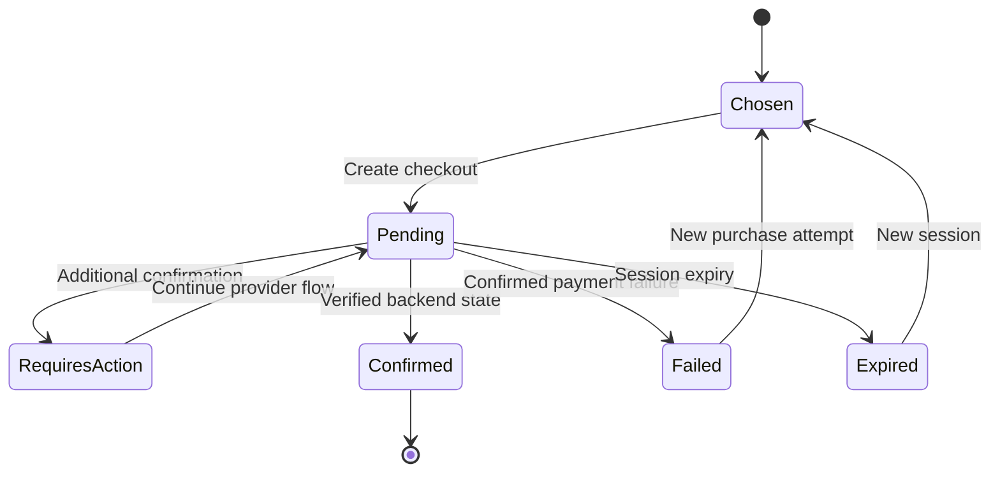

# ТЗ публичного сайта и оплаты подписки Business Watchdog

Дополнение1.1. MUST P1; демо каталога и signup допустимы P0 без реального charge. Это продажа **нашей услуги**, не checkout покупателя WooCommerce-магазина. Provider для нашей коммерции выбирается после проверки доступности владельцу бизнеса; Stripe Billing ниже только референсный adapter, а не утверждение возможности открыть аккаунт в любой стране.

## 1 Цель и стек

Гость понимает что проверяет сервис, выбирает подходящий tariff, регистрируется, безопасно оплачивает нашу recurring подписку и получает понятный access state. Public site pages SSR Blade+Vite или prerendered Vue; интерактивные pricing/signup components Vue3. Customer cabinet Vue SPA. Всё в существующем Laravel монолите, без обязательного Nuxt/нового CMS.

Public origin и `/app` customer origin могут совпадать. Owner/admin origin изолирован. Public site и billing flow MUST поддерживать `ru`, `en`, `de` через versioned content/translation keys. Public pages могут кешироваться; user/billing/private pages `Cache-Control: no-store`. SEO title/description/canonical по locale, robots noindex для login/checkout return/private app/admin. Не публиковать private API response в статические bundle artifacts.

## 2 Карта страниц

| Route | Содержимое | CTA |
|---|---|---|
| / | Задачи сервиса, кому подходит, реальные boundaries, как подключить | Тарифы/Начать |
| /features | Money/Checkout capabilities P0/P1/P2, supported platforms | Проверить совместимость |
| /pricing | Published plans/prices, interval/currency, limits, taxes visibility | Выбрать tariff |
| /how-it-works | Подключение, safe browser scope, no AI claim | Создать аккаунт |
| /compatibility | Tested Woo/gateway/checkout versions and unsupported cases | Подключить магазин |
| /faq | Subscription, trial, invoices, cancellation, data retention | Support |
| /signup и /login | Customer auth | Продолжить выбранный tariff |
| /checkout | Authenticated tenant_owner purchase summary | Перейти к provider оплате |
| /checkout/return | Payment confirmation pending/confirmed/requires_action | Кабинет/Продолжить оплату |
| /checkout/cancel | Session cancelled/abandoned, safe retry | Вернуться к тарифам |
| /legal/terms и /legal/privacy | Published policy version/date | — |
| /contact | Service contact/working hours | Создать support request |

Лендинг не заявляет «гарантируем отсутствие потерь» и «проверяем реальные платежи», если включён только payment_form check. Test price/currency не публикуются как реальные продажные. Showcase/screenshots synthetic с маркировкой, не реальные чужие магазины.

## 3 Pricing и выбор

Поля карточки: plan code/title, цена и currency, month/year interval, taxes included/excluded/pending calculation из configured policy, max stores, check frequency, included integrations, event quota, history/artifact retention, support scope, trial availability. Price приходит только с backend `billing_prices`, published version. Browser amount/price_id не является доверенным total.

Currency switching показывает лишь опубликованные prices. Не делать FX конверсию локально. Annual «экономия» вычисляется относительно реальных monthly/annual published prices того же plan/currency; если пары нет — badge не показывать. Не округлять annual до monthly так, чтобы скрыть фактическое yearly списание: «X в год, примерно Y/месяц». Taxes/discounts финально по provider preview; до него явно pending.

Выбор фиксирует plan_version_id+price_id+interval; short-lived server selection reference. Login/register сохраняет выбор, но после auth backend повторно проверяет published price, eligibility и tenant role. Старый/retired price возвращает price_changed и предлагает новый summary; не списывать по скрыто заменённой цене.

## 4 Регистрация и tenant

Signup input name,email,password,confirmation,organization_name,locale/timezone, terms acceptance checkbox с version ID; маркетинговое согласие отдельно и optional. Privacy policy link обязателен; формы не объявляют любое согласие универсальным правовым основанием. Backend сохраняет required purchase acceptance версии, timestamps и purpose, не секреты/IP по умолчанию.

Existing email → login/recovery без создания duplicate tenant/subscription. Email verification перед trial activation/checkout finalization обязательна. Если staff создаёт аккаунт клиента вручную, password setup through token, не email plaintext password. Пользователь с несколькими organizations выбирает target tenant перед checkout; active tenant не угадывается из названия организации.

Trial default14д без карты — proposed policy для пилота, owner может утвердить другое. Начинается явной кнопкой `Начать пробный период` после email verification. Trial не создаёт automatic paid renewal без явного payment agreement. Existing trial active переносит start/end в paid transition policy; не начислять вторую trial при restart/смене tariff.

## 5 Checkout screen

Только tenant_owner. Показывать issuer/business contact после утверждения, tenant, tariff version, final price/currency/period, next charge terms, trial/grace, taxes/discounts известные на этом этапе, cancellation policy/link и подтверждение recurring intent. Request only price_id, accepted_policy_version_ids, return_path, expected subscription version. Amount,total,currency из browser игнорируются/rejected.

Backend creates `billing_checkout_sessions`, связывает tenant/user/price/mode, hosted provider reference, expires_at, idempotency key, safe return origin. Buttons disabled while submitting, repeat after timeout retrieves same pending session. Purchase endpoint не доступен tenant_admin/platform staff session без customer role. Cards собирает hosted provider page, наша форма не хранит PAN/CVV.

Переход на provider URL лишь из server verified allowlist. Return/cancel URL same-origin allowlisted path, no arbitrary external link. Public query `success=1` и session ID не изменяют entitlement. Session lookup requires current tenant authorization и compares provider account/mode.

## 6 Подтверждение оплаты и состояния

Return page сразу показывает «Проверяем оплату» и subscription summary. Poll endpoint2с первые30с, затем5с до2мин; после timeout «Подтверждение ещё не получено», кнопка refresh и safe кабинет link. Poll остановить в hidden tab, rate-limit backend. Closing tab не теряет оплату: verified webhook/provider refresh обновляет состояние независимо от browser.

Confirmed: invoice/payment подтверждены и relevant subscription eligibility активна; backend grants access once. Requires_action: safe provider continuation/portal, не active monitoring. Failed/expired/cancelled: no paid grant, trial если действовал сохраняется по его deadline. Unknown provider state: no new paid grant, сохраняется ранее оплаченный доступ до documented paid_until; pending не делает действующего клиента suspended раньше времени.

Нельзя double count checkout completed и invoice paid как два полученных платежа. Если asynchronous method разрешён billing adapter, completed session может ждать payment confirmation; пока доступ pending. Типы методов выбираются commercial policy, не все автоматически включаются.

## 7 Продление смена тарифа отмена

Paid renewal backend automatic, UI shows next date/provider state. Failed renewal → past_due и grace7д (proposed config), notice+manage payment. Retry через provider; frontend не запускает repeated charges самостоятельно. Action required даёт safe provider route. Успешная late payment восстанавливает доступ по real paid period; не продлевать ещё на30д от даты поступления без provider period evidence.

Upgrade preview returns due_now,currency,taxes,proration lines, next recurring price,effective_at,price version и preview token TTL10мин. User confirms token; backend rechecks current subscription version. Если amount изменился — fresh preview409. Никакого optimistic upgraded access пока confirmed conditions не выполнены. Zero-cost approved upgrade возможен только если verified provider state/policy допускает.

Downgrade scheduled for period_end, existing benefits действуют до effective_at. Выбор retained stores описан CLIENT-PANELS. Cancellation at period_end summary: последняя дата monitoring, renewals stop, data retention и доступ к истории; optional feedback не препятствует отмене. Resume scheduled cancellation проходит backend provider sync. Refund не означает cancellation automatically, и наоборот; интерфейс показывает оба состояния.

## 8 Content и доступность

Обычный versioned content file/Blade acceptable P0. Если owner должен публиковать content через panel, P1 minimal content entity public_content_pages: slug,locale,version,draft/published, sanitized body и title/meta. Не WYSIWYG arbitrary script; HTML allowlist и preview. Legal published versions immutable и acceptance связывается с конкретной version.

Public forms имеют labels, keyboard focus, field errors, error summary, disabled submit/loading. Recurring price/period/automatic renewal не спрятаны в мелком шрифте. На mobile price+period и payment result помещаются без horizontal scrolling. External payment navigation объясняется plain text.

Performance budget pilot: public pages Lighthouse mobile performance≥80 на документированном стенде, no private third-party analytics in checkout по default. Это target после implementation, не измеренный результат текущего пакета. Public analytics opt-in только при выбранной consent policy; data в billing ledger не зависит от analytics consent.

## 9 Backend contracts

| API | Request | Response |
|---|---|---|
| GET /api/v1/public/plans | locale,currency,interval | Published plan/price DTO, config version |
| POST /api/v1/billing/trial | plan_version_id,policy acceptances | Trial subscription DTO |
| POST /api/v1/billing/checkout | price_id,policy_version_ids,return_path | checkout_id,hosted_url,expires_at,status |
| GET /api/v1/billing/checkouts/{id} | Auth | checkout and actual billing/access state |
| GET /api/v1/billing/subscription | Auth owner | Current contract,paid_until,limits,renewal |
| POST /api/v1/billing/portal | return_path | short-lived provider portal URL |
| POST /api/v1/billing/plan-change-preview | price_id,requested_effect | versioned preview token+amounts |
| POST /api/v1/billing/plan-change | preview_token | action_id,status,effective_at |
| POST /api/v1/billing/cancel | at_period_end=true,reason optional | server state, effective_at |
| POST /api/v1/billing/resume | expected_version | actual provider-derived state |
| GET /api/v1/billing/invoices | cursor filters | Own invoices |
| GET /api/v1/billing/invoices/{id}/download | Auth owner | private URL,expiry |

Owner-only mutations требуют CSRF и Idempotency-Key. Trial acceptance и checkout return never anonymous entitlement grant. Exact DTO/runtime schema в `contracts/platform-billing-api.yaml` и ADMIN-BACKEND.

## 10 Приёмка

PAY-01 public plan price matches published backend. PAY-02 forged browser amount rejected. PAY-03 signup existing email no duplicate customer/subscription. PAY-04 unknown retired price requires new summary. PAY-05 pending/return query не даёт paid access. PAY-06 webhook before/after/no return activates once. PAY-07 duplicate/out-of-order billing events safe. PAY-08 failed/requires_action states correct. PAY-09 closing browser не loses successful payment. PAY-10 LIVE/TEST/account mismatch rejected. PAY-11 yearly real charge plainly shown. PAY-12 cross-tenant checkout/invoice inaccessible. PAY-13 cancel stops renewal independently of data deletion. PAY-14 downgrade preserves current period. PAY-15 proration amount changed requires re-preview. PAY-16 billing records never mix with store captures/refunds.

Референсы provider semantics: https://docs.stripe.com/billing/subscriptions/webhooks и https://docs.stripe.com/webhooks. Конкретный адаптер и event mapping проверяются sandbox до реального приёма денег; продуктовые defaults здесь собственные проектные решения.
